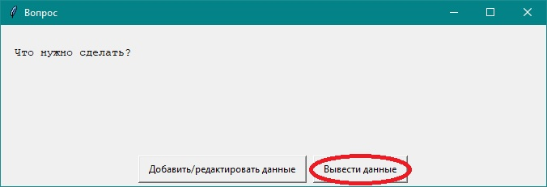
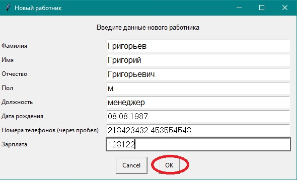
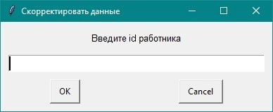

# Инструкция по использованию передовой информационной системы учета сотрудников

## 1. Вывод списка сотрудников: 

### 1.1 После запуска программы выберите пункт *"Вывести данные"*

### 1.2 Затем выберите поле по кторому хотите отфильтровать данные, если хотите вывести все данные нажмите *"Без фильтра"*

### 1.3 Отобразится результат поиска

## 2. Добавление сотрудника в базу: 

### 2.1 После запуска программы выберите пункт *"Добавить/редактировать данные"*

### 2.2 Затем выберите пункт *"Добавить данные"*

### 2.3 Заполните все поля и нажмите *"ok"*

## 3. Изменение данных сотрудника: 

### 3.1 После запуска программы выберите пункт *"Добавить/редактировать данные"*

### 3.2 Затем выберите пункт *"Редактировать данные"*

### 3.3 Введите номер сотрудника, данные которого хотите изменить и нажмите *"ok"*

### 3.4 Отредактируйте поля и нажмите *"ok"*

## 4. Продолжение работы: 
### 4.1 После завершения любого действия появится следующее окно:

### 4.2 Нажмите *"Продолжить"*, чтобы продолжить и "*Закончить*", чтобы прекратить работу системы

